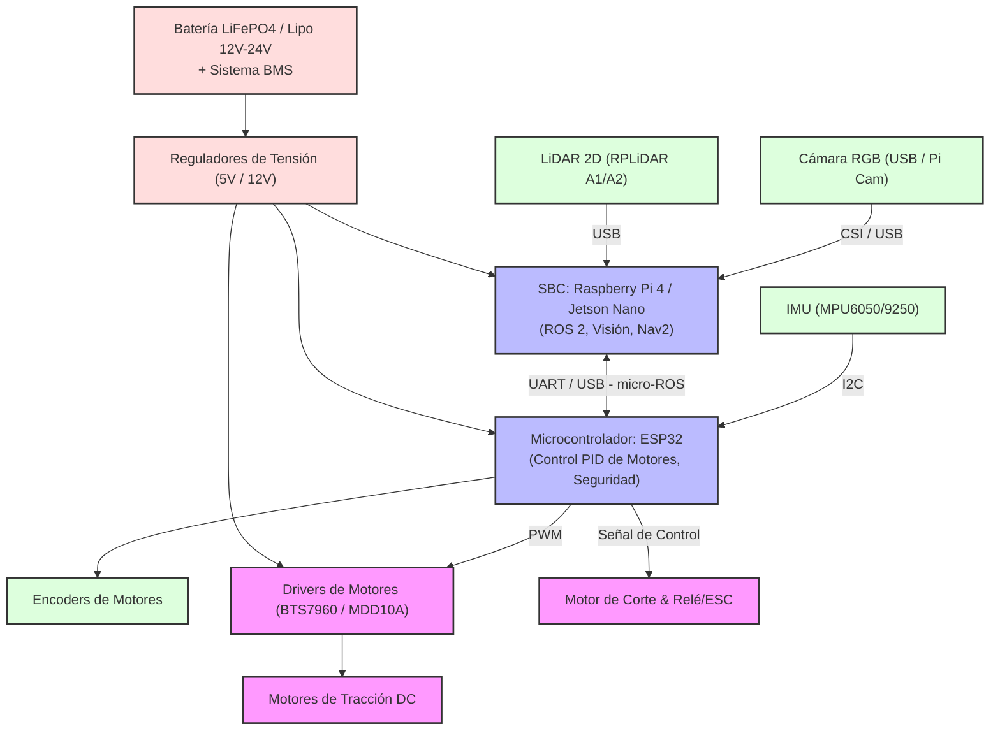

# Cortadora de Pasto Semi-Autónoma (LawnMowerBot) 🤖🌾

Este proyecto consiste en el diseño, desarrollo e implementación de una **máquina cortadora de pasto semi-autónoma** orientada a la robótica móvil de servicio. La máquina cuenta con la capacidad de aprender un recorrido guiado por el usuario (modo teleoperación) y replicarlo de manera exacta y autónoma. Integra tecnologías modernas de percepción como sensores LiDAR 2D y visión computacional (cámara RGB) para garantizar la seguridad operacional frente a obstáculos dinámicos como humanos y mascotas.

---

## 🎯 Objetivos del Proyecto

1. **Navegación Semi-Autónoma ("Teach-and-Repeat"):** Grabar recorridos definidos manualmente y reproducirlos de forma estable con alta precisión en el posicionamiento y control de trayectoria.
2. **Mapeo y Localización (SLAM):** Utilizar un sensor LiDAR 2D para generar mapas bidimensionales del entorno y realizar localización en tiempo real.
3. **Detección de Obstáculos Dinámicos y Seguridad:** Emplear una cámara RGB y algoritmos de Deep Learning para detectar e identificar personas y animales domésticos en el trayecto, deteniendo la máquina o rodeándolos de forma segura.
4. **Arquitectura Robusta y Segura:** Implementar un sistema de parada de emergencia (E-Stop) tanto por hardware como por software.

---

## 🛠️ Arquitectura de Hardware Propuesta

Para cumplir con las demandas de procesamiento físico y lógico, dividimos la arquitectura en dos niveles de control:

### Detalle de Componentes
*   **Procesamiento de Alto Nivel (SBC):** Raspberry Pi 4 (4GB/8GB) o NVIDIA Jetson Nano. Encargado de ejecutar ROS 2, procesar los datos del LiDAR (SLAM) y ejecutar el modelo de detección de objetos en tiempo real de la cámara RGB.
*   **Procesamiento de Bajo Nivel (MCU):** ESP32. Encargado de la lectura de sensores locales (IMU, Encoders), control en lazo cerrado de motores de tracción (PID), interfaz del motor de corte y seguridad directa (E-Stop).
*   **Sensores de Percepción:**
    *   **LiDAR 2D (ej. RPLiDAR A1/A2):** Rango de 12m, frecuencia de muestreo de 5.5-10Hz, escaneo de 360 grados.
    *   **Cámara RGB (ej. Pi Cam V2 o Cámara USB Gran Angular):** Captura a 720p/1080p para la inferencia visual.
    *   **Odometría (Encoders + IMU MPU6050):** Fusión de sensores mediante un filtro de Kalman para una odometría confiable en terrenos con imperfecciones.
*   **Actuación y Potencia:**
    *   **Motores de Tracción:** Motores DC con reductora (alta fuerza de torque) y encoders de cuadratura integrados.
    *   **Motor de Corte:** Motor DC sin escobillas (BLCD) con ESC o motor DC de alta potencia con relé de seguridad.
    *   **Batería:** Pack de LiFePO4 de 12V o 24V (preferido por estabilidad química y ciclos de vida).

---

## 💻 Arquitectura de Software (ROS 2 Stack)

El sistema de software se estructurará sobre **ROS 2 (Robot Operating System)**, aprovechando su modularidad y capacidad para sistemas en tiempo real:

1.  **Capa de Drivers y Fusión de Sensores:**
    *   `micro-ros` en el ESP32 para publicar la odometría de rueda e IMU a ROS 2, y recibir comandos de velocidad (`cmd_vel`).
    *   `robot_localization` para fusionar encoders e IMU, generando la odometría filtrada (`/odom`).
    *   `rplidar_ros` para publicar las lecturas de distancia como un `/scan` en ROS 2.
2.  **Capa de Mapeo y Localización:**
    *   `slam_toolbox` en modo sincrónico para construir el mapa 2D en la fase de mapeo manual.
3.  **Capa de Navegación (Teach-and-Repeat):**
    *   **Teach (Grabación):** Nodo personalizado que almacena la pose del robot (`/amcl_pose` o `/odom`) de forma periódica en un archivo JSON/YAML mientras el usuario maneja el robot de forma remota.
    *   **Repeat (Reproducción):** Nodo que lee la secuencia de waypoints guardados y los envía al planificador de `Navigation2` (Nav2) usando un waypoint follower o un controlador de persecución pura (Pure Pursuit) adaptado.
4.  **Capa de Visión Computacional & E-Stop:**
    *   Nodo basado en OpenCV y ONNX/TensorFlow Lite ejecutando **YOLOv8-nano** optimizado.
    *   Si se detecta un humano o animal con un umbral de confianza > 75% y a una distancia estimada crítica (basada en el tamaño del cuadro delimitador u homografía con el LiDAR), se publica un mensaje de parada de emergencia en el tópico `/estop`.
    *   El ESP32 escucha directamente este estado y corta inmediatamente la energía a los motores y a la cuchilla.

---

> [!NOTE]
> La seguridad del sistema es prioridad cero. La cuchilla de corte solo se habilitará si el sistema se encuentra en modo autónomo o teleoperado verificado, y se detendrá instantáneamente ante cualquier fallo de comunicación (Heartbeat perdido), detección de obstáculos a menos de 1.5 metros, o la activación física del E-Stop.
