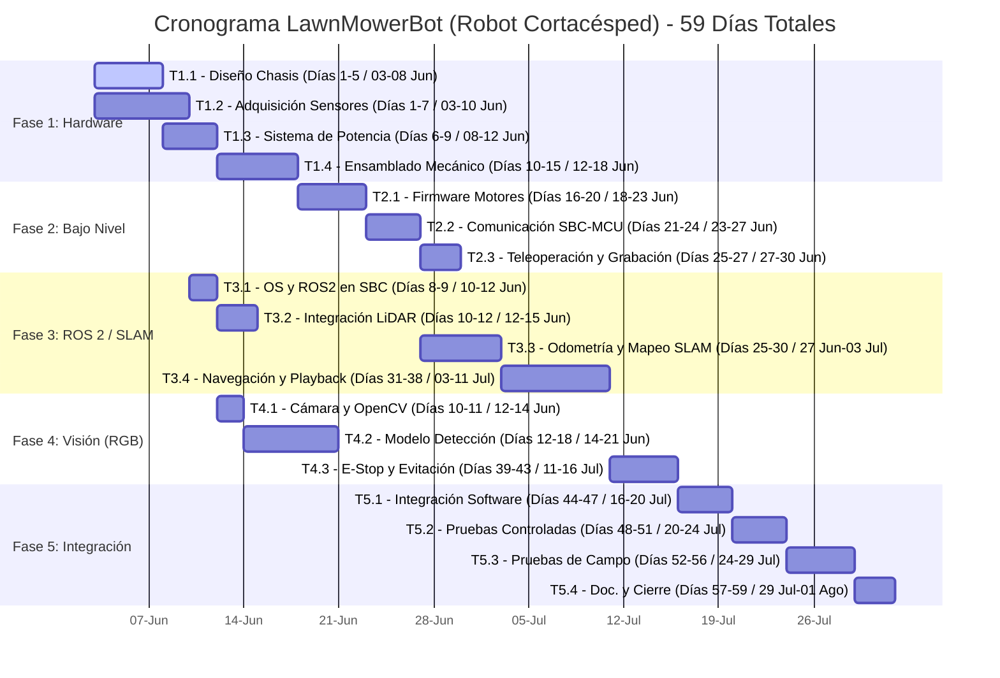

# Planificación del Proyecto: LawnMowerBot 📅🔍

Este documento detalla la estructura de tareas (WBS), la secuencia temporal del desarrollo, el grafo de dependencias y el análisis del camino crítico (CPM) para la cortadora de pasto semi-autónoma.

---

## 📊 Grafo de Dependencias del Proyecto

El siguiente diagrama muestra el flujo de trabajo del proyecto. Las tareas en **rojo** pertenecen al **Camino Crítico (Critical Path)**, lo que significa que cualquier retraso en ellas pospondrá la fecha de finalización del proyecto. Las flechas rojas indican la secuencia crítica.

```mermaid
graph TD
    %% Estilos
    classDef critical fill:#ffebee,stroke:#c62828,stroke-width:3px,color:#b71c1c;
    classDef normal fill:#e1f5fe,stroke:#0288d1,stroke-width:1.5px,color:#01579b;

    %% Nodos de Tareas
    T1_1["T1.1: Chasis y Motores (5d)"]:::critical
    T1_2["T1.2: Sensores y SBC (7d)"]:::normal
    T1_3["T1.3: Sistema de Potencia (4d)"]:::critical
    T1_4["T1.4: Ensamblado y Cableado (6d)"]:::critical
    
    T2_1["T2.1: Firmware Motores (5d)"]:::critical
    T2_2["T2.2: Comunicación SBC-MCU (4d)"]:::critical
    T2_3["T2.3: Teleoperación y Grabación (3d)"]:::normal
    
    T3_1["T3.1: Configuración ROS2 (2d)"]:::normal
    T3_2["T3.2: Integración LiDAR (3d)"]:::normal
    T3_3["T3.3: SLAM y Odometría (6d)"]:::critical
    T3_4["T3.4: Nav2 y Playback (8d)"]:::critical
    
    T4_1["T4.1: Cámara y OpenCV (2d)"]:::normal
    T4_2["T4.2: Modelo Detección (7d)"]:::normal
    T4_3["T4.3: E-Stop / Evitación (5d)"]:::critical
    
    T5_1["T5.1: Integración de Software (4d)"]:::critical
    T5_2["T5.2: Pruebas Controladas (4d)"]:::critical
    T5_3["T5.3: Pruebas de Campo (5d)"]:::critical
    T5_4["T5.4: Doc. y Cierre (3d)"]:::critical

    %% Conexiones
    T1_1 --> T1_3           %% 0
    T1_2 --> T1_4           %% 1
    T1_3 --> T1_4           %% 2
    T1_4 --> T2_1           %% 3
    T2_1 --> T2_2           %% 4
    T2_2 --> T2_3           %% 5
    T2_2 --> T3_3           %% 6
    T1_2 --> T3_1           %% 7
    T3_1 --> T3_2           %% 8
    T3_1 --> T4_1           %% 9
    T3_2 --> T3_3           %% 10
    T2_3 --> T3_4           %% 11
    T3_3 --> T3_4           %% 12
    T4_1 --> T4_2           %% 13
    T4_2 --> T4_3           %% 14
    T3_4 --> T4_3           %% 15
    T4_3 --> T5_1           %% 16
    T5_1 --> T5_2           %% 17
    T5_2 --> T5_3           %% 18
    T5_3 --> T5_4           %% 19

    %% Colorear camino crítico en los enlaces (linkStyle)
    linkStyle 0,2,3,4,6,12,15,16,17,18,19 stroke:#c62828,stroke-width:3px;
```

---

## 📅 Diagrama de Gantt del Proyecto

A continuación, se presenta la distribución temporal de las tareas a lo largo de los **59 días estimados** de duración del proyecto:



---

## 📈 Análisis del Camino Crítico (CPM)

Calculado mediante programación CPM, el proyecto tiene una duración mínima de **59 días de trabajo**. 

*   **ES (Early Start / Inicio más Temprano):** El primer día posible en el que la tarea puede comenzar. (E = *Early* / Temprano, S = *Start* / Inicio).
*   **EF (Early Finish / Fin más Temprano):** El primer día posible en el que la tarea puede terminar. (E = *Early* / Temprano, F = *Finish* / Fin).
*   **LS (Late Start / Inicio más Tardío):** El último día permitido para comenzar la tarea sin retrasar la fecha final del proyecto. (L = *Late* / Tardío, S = *Start* / Inicio).
*   **LF (Late Finish / Fin más Tardío):** El último día permitido para terminar la tarea sin retrasar la fecha final del proyecto. (L = *Late* / Tardío, F = *Finish* / Fin).
*   **Slack (Holgura):** Días máximos que la tarea puede demorarse sin alterar el calendario final.

| Código | Descripción de la Tarea | Duración (Días) | Predecesores | ES | EF | LS | LF | Holgura (Slack) | ¿Camino Crítico? |
| :--- | :--- | :---: | :---: | :---: | :---: | :---: | :---: | :---: | :---: |
| **T1.1** | Diseño/Selección de Chasis y Motores | 5 | Ninguno | 0 | 5 | 0 | 5 | 0 | **SÍ** |
| **T1.2** | Selección/Adquisición de Sensores y SBC | 7 | Ninguno | 0 | 7 | 2 | 9 | 2 | No |
| **T1.3** | Diseño de Sistema de Potencia | 4 | T1.1 | 5 | 9 | 5 | 9 | 0 | **SÍ** |
| **T1.4** | Ensamblado Mecánico y Cableado | 6 | T1.2, T1.3 | 9 | 15 | 9 | 15 | 0 | **SÍ** |
| **T2.1** | Firmware de Control de Motores (PWM/Encoders) | 5 | T1.4 | 15 | 20 | 15 | 20 | 0 | **SÍ** |
| **T2.2** | Protocolo de Comunicación SBC-MCU | 4 | T2.1 | 20 | 24 | 20 | 24 | 0 | **SÍ** |
| **T2.3** | Teleoperación y Grabación de Recorridos | 3 | T2.2 | 24 | 27 | 27 | 30 | 3 | No |
| **T3.1** | Configuración de SO y ROS2 en SBC | 2 | T1.2 | 7 | 9 | 19 | 21 | 12 | No |
| **T3.2** | Integración de LiDAR 2D en ROS2 | 3 | T3.1 | 9 | 12 | 21 | 24 | 12 | No |
| **T3.3** | Odometría y Mapeo SLAM | 6 | T3.2, T2.2 | 24 | 30 | 24 | 30 | 0 | **SÍ** |
| **T3.4** | Navegación y Reproducción de Rutas (Nav2) | 8 | T3.3, T2.3 | 30 | 38 | 30 | 38 | 0 | **SÍ** |
| **T4.1** | Driver de Cámara RGB y OpenCV | 2 | T3.1 | 9 | 11 | 29 | 31 | 20 | No |
| **T4.2** | Integración de Modelo de Detección (YOLO/SSD) | 7 | T4.1 | 11 | 18 | 31 | 38 | 20 | No |
| **T4.3** | Nodo de E-Stop/Evitación de Obstáculos Dinámicos | 5 | T4.2, T3.4 | 38 | 43 | 38 | 43 | 0 | **SÍ** |
| **T5.1** | Integración de Software (Launch Files) | 4 | T4.3 | 43 | 47 | 43 | 47 | 0 | **SÍ** |
| **T5.2** | Pruebas en Entorno Controlado (Seco/Simulación) | 4 | T5.1 | 47 | 51 | 47 | 51 | 0 | **SÍ** |
| **T5.3** | Pruebas de Campo (Corte y Evitación Real) | 5 | T5.2 | 51 | 56 | 51 | 56 | 0 | **SÍ** |
| **T5.4** | Documentación y Ajustes Finales | 3 | T5.3 | 56 | 59 | 56 | 59 | 0 | **SÍ** |

---

## 🔍 Estudio de Cuellos de Botella y Riesgos Críticos

Analizando los resultados de la ruta crítica y las holguras, identificamos tres áreas que pueden poner en riesgo los tiempos del proyecto:

### 1. El Abastecimiento de Hardware (T1.2) como "Falso Amigo"
*   **Análisis:** La adquisición de sensores y la computadora de placa única (SBC) tiene una **holgura de solo 2 días**. Si la importación o la compra local de sensores (LiDAR, cámara) se retrasa más de 48 horas respecto a lo estimado, esta tarea se convertirá inmediatamente en el nuevo camino crítico, demorando el ensamblado de hardware (`T1.4`) y el inicio de la configuración del sistema operativo (`T3.1`).
*   **Acción Mitigadora:** Realizar la compra de sensores el Día 1 del proyecto, en paralelo al diseño del chasis.

### 2. El Cuello de Botella de Hardware-Software: Comunicación SBC-MCU (T2.2)
*   **Análisis:** Es el puente crítico entre el hardware físico (`ESP32`) y ROS 2 (`Raspberry Pi`). Si el protocolo micro-ROS o la transmisión serial personalizada tiene pérdidas de paquetes, ruido eléctrico, o latencia indeseada, bloqueará el desarrollo de la Odometría/SLAM (`T3.3`), la cual requiere teleoperar la máquina.
*   **Acción Mitigadora:** Utilizar una librería robusta ya probada (ejemplo: micro-ROS sobre serial) en lugar de inventar un protocolo personalizado de bytes sin estructurar.

### 3. La Alta Holgura de la Cámara e IA (T4.1, T4.2)
*   **Análisis:** La puesta a punto del modelo de visión tiene una **holgura masiva de 20 días**. Esto se debe a que la cámara puede configurarse muy temprano (Día 9) y el modelo entrenarse de forma independiente a que el robot se mueva. Sin embargo, no hay que confiarse: la inferencia visual suele ser un **cuello de botella de recursos computacionales** (la CPU de la Raspberry Pi puede quedarse corta para procesar frames e inferencias a la vez que corre SLAM y Nav2).
*   **Acción Mitigadora:** Empezar probando modelos extremadamente ligeros (`YOLOv8-nano` cuantizado a INT8, o `MobileNet-SSD`) y medir el uso de CPU/RAM antes de la integración final.

---

> [!IMPORTANT]
> **Hito Crítico de Decisión (Día 30):** Al finalizar la odometría y mapeo SLAM (`T3.3`), se debe evaluar si el robot localiza correctamente en superficies rugosas (pasto). Si la odometría física resbala demasiado, la holgura acumulada en el resto de tareas secundarias se consumirá rápidamente rediseñando ruedas o implementando fusión de sensores más agresiva.
